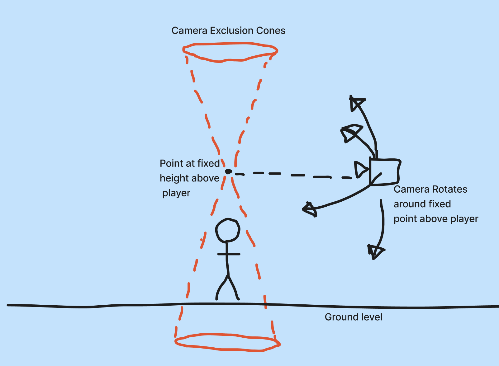
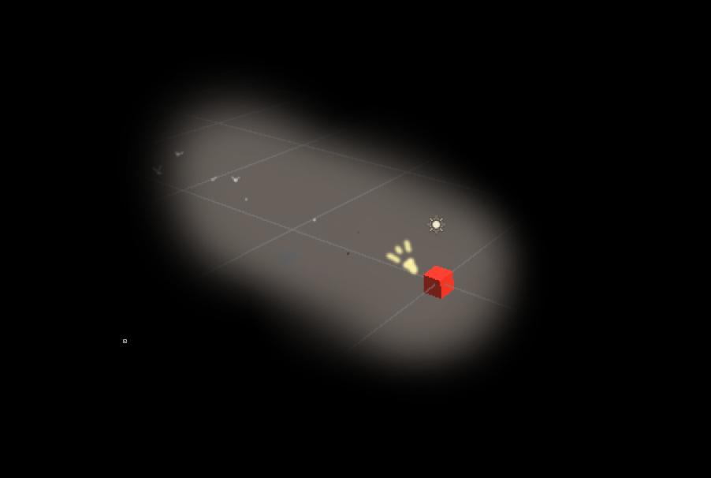
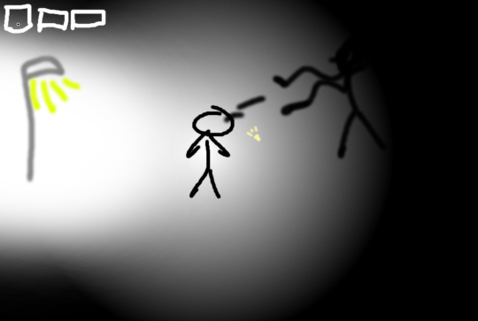
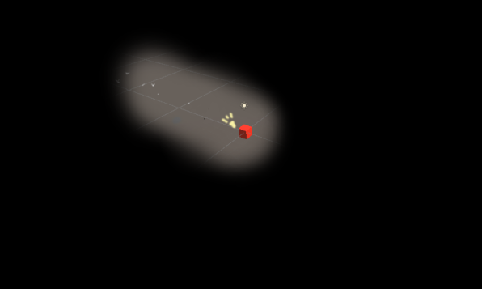
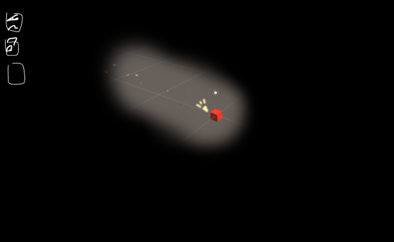
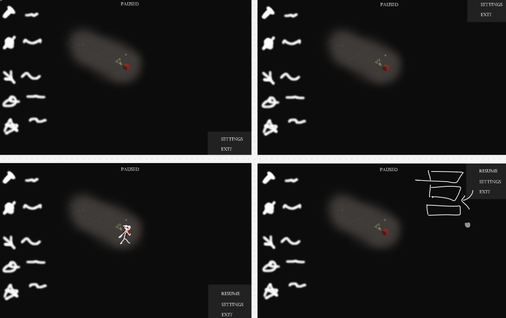
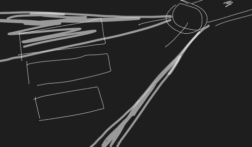

# Game Design Document (GDD)

  

_AI generated concept image of Lightbringer (Source: Bing Image Creator)_

### Table of contents

1. [Introduction](#introduction)
2. [Game Overview](#game-overview)
    - [Core Concept](#core-concept)
    - [Related Genres and Games](#related-genres-and-games)
    - [Target Audience](#target-audience)
    - [Unique Selling Points (USPs)](#unique-selling-points-usps)
3. [Story and Narrative](#story-and-narrative)
    - [Backstory](#backstory)
    - [Characters](#characters)
4. [Gameplay and Mechanics](#gameplay-and-mechanics)
    - [Player Perspective](#player-perspective)
    - [Controls](#controls)
    - [Progression](#progression)
    - [Gameplay Mechanics](#gameplay-mechanics)
5. [Levels and World Design](#levels-and-world-design)
    - [Game World](#game-world)
    - [Objects](#objects)
    - [Physics](#physics)
6. [Art and Audio](#art-and-audio)
    - [Art Style](#art-style)
    - [Sound and Music](#sound-and-music)
    - [Assets](#assets)
7. [User Interface (UI)](#user-interface-ui)
8. [Technology and Tools](#technology-and-tools)
9. [Team Communication, Timelines and Task Assignment](#team-communications-timelines-and-task-assignment)
10. [Possible Challenges](#possible-challenges)
11. [References](#references)

### Introduction

_Lightbringer_ is a third-person roguelike set in an unknown world of darkness. It's like Vampire Survivors with LIMBO aesthetics but more focused on exploration than combat. The player must fight off the darkness enclosing on them with tools of light, survive as long as they can while uncovering the mysteries of the past.

## Game Overview

### Core Concept

World is covered in a dark mist/shadows, survivor is trying to fight off the mist using tools of light. Aim is to survive for as long as possible while navigating through the darkness.

### Related Genres and Games

-   Roguelike
-   Auto-battler
-   RPG
-   Vampire Survivors
-   Hades

### Target Audience

Gameplay doesn't require any great deal of mechanical skill, targeting more casual players. Each playthrough of the game should be completable within 10 minutes. Controls and mechanics will be intuitive and easy to pick up without any help documentation or resources.

### Unique Selling Points (USPs)

-   Unique weapon/tool usage and combinations
-   Not the typical horde killer gameplay
-   Large-level instead of dungeon room based roguelike
-   More exploration focused
-   Has lore the user can discover or infer from environmental cues.

## Story and Narrative

### Backstory

#### Premise

-   Village/town fell into darkness suddenly; unknown reason.
-   Adventurers have failed in recovering the place.
-   You are an adventurer trying to recover light in the area.

#### Storyline

-   You meet/defeat different enemies and characters while trying to recover the town.
-   Certain characters appear as past adventurers who have failed to escape/reach the end
-   Certain characters drop items that help progress the game and the story such as journals, crafting guides, other tools, etc.

### Characters

Player character is a being of light, as they collect items it could show on their body.
Enemies that spawn (shadow silhouettes) could be people that failed to escape/reach the end. Could have the player’s failed runs (along with their items) appear as enemies.

## Gameplay and Mechanics

Player spawns into a dark environment surrounded by shadow/dark mist (that slowly closes in on them), equipped with a basic weapon of light, they can use it to clear the darkness temporarily. Player can move around and point their weapon into the darkness, and sometimes they may discover a path or special point of interest (related to light, could be a streetlamp or some village ruins, etc). Each point of interest discovered becomes a sort of permanently “liberated” lit up area and gives them exp to level up their weapons/items, or they may discover new weapons/items to pick up.

### Player perspective

  

Third-Person perspective with a camera that can move around a point above the player character.

### Controls

-   Mouse to control third-person camera/aim
-   RMB to aim down sights (zoom in over shoulder)
-   Tab for inventory -> inventory displays item information
-   Esc for both settings/pause/menu screen

### Progression

#### Player Progression

-   Find POIs to have safe zones
-   Find weapons/items to strengthen character
-   Certain items synergise better with certain weapons

#### Difficulty Progression

-   Darkness becomes harder to clear, closes in faster as time progresses.
-   Enemies can slowly be seen lurking in the darkness as time progresses (no silhouettes visible within first few minutes of gameplay)
-   Enemies become manifested when difficulty reaches threshold and can be damaged/damage the player

### Gameplay Mechanics

#### Combat Mechanic

-   Player uses light to see enemies
-   Defeating an enemy increases light radius (until a maximum limit)
-   Getting hit by an enemy decreases light radius
-   Player loses when light radius is gone
-   Light radius = HP

#### Item Drop Mechanic

-   Certain enemies drop items
-   Item drops progress gameplay
-   Pickup radius around player where items vacuum into them

## Levels and World Design

### Game World

2.5D (look around with camera, plane of movement is pretty much top down 2D)
One (generated?) level for player to navigate, no map or minimap

### Objects

Buildings, dilapidated houses. Functions as environmental storytelling. Buckets?

### Physics

Certain points of interest may have interactable physics objects (rope hanging somewhere? Bucket on a rope?) (enemies drop interactable buckets?)
Certain weapons may interact with dynamic environmental objects.

## Art and Audio

### Art Style

#### Aesthetic

-   Mostly greyscale
-   Some colour highlights (eg. eyes different colour, enemy glowing outline different colour)

#### References

-   Limbo
-   Little Nightmares
-   Don’t Starve

  

Game Scene

  

How enemies could appear in game

### Sound and Music

Echoey - high reverb -> alone
White noise-ish -> eerie vibes
Louder as enemies move closer

1. SFX for game selection (eg. hover over menu, switch item in inventory)
2. SFX for player character
    - walking on different surfaces
    - getting hit
    - picking up items
3. SFX for weapons
    - different weapons going off
    - different weapons combining
4. SFX for enemies
    - enemies killed
    - enemies hit character
    - dropping items
5. Ambient sounds
    - Freeing different areas adds to the ambient sounds
    - Fireflies?
    - Tinkles and light sprinkle sounds
    - Echoes of past civilisation
6. Discover special enemies
    - Plays sound for past adventurers
    - Plays unique sound for when discovering your past run
7. Death-related instances
    - Suspenseful music before imminent death
    - Classical strings?
    - Death music
    - Strings wipe noise

### Assets

Lamppost:
https://assetstore.unity.com/packages/3d/environments/urban/lamppost-269488

Village houses pack:
https://assetstore.unity.com/packages/3d/characters/village-houses-pack-63695

Medieval environment pack:
https://assetstore.unity.com/packages/3d/environments/fantasy/free-slavic-medieval-environment-town-interior-and-exterior-167010

Rocks and Boulders:
https://assetstore.unity.com/packages/3d/props/exterior/rock-and-boulders-2-6947

## User Interface (UI)

No visible GUI when in-game
An overlay can be shown at will to see items/weapons picked up

  

Typical game scene

  

Pressing tab to show overlay

  

  

Possible pause menus

## Technology and Tools

-   Unity 2022
-   GitHub
-   Figma for brainstorming/ideation
-   Audacity
-   Paint.net / Photoshop

## Team Communications, Timelines and Task Assignment

-   Discord Meetings to delegate work
-   Figma/Google docs for collaborative document work

## Possible Challenges

-   Level design/asset finding
-   Weapon interactions with each other
-   Enemy/darkness implementation
-   Character interactions

### References

Need more help? Check out these resources, which everything in this document is based on:

-   [GitHub Flavoured Markdown](https://guides.github.com/features/mastering-markdown/) (official guide)
-   [GitHub LaTeX](https://docs.github.com/en/get-started/writing-on-github/working-with-advanced-formatting/writing-mathematical-expressions)
-   [GitHub Diagrams](https://docs.github.com/en/get-started/writing-on-github/working-with-advanced-formatting/creating-diagrams)
-   [Mermaid Docs](https://mermaid-js.github.io/mermaid/#/)
-   [Mermaid Live Editor](https://mermaid-js.github.io/mermaid-live-editor/)
-   [Emoji Picker](https://github-emoji-picker.rickstaa.dev/)
