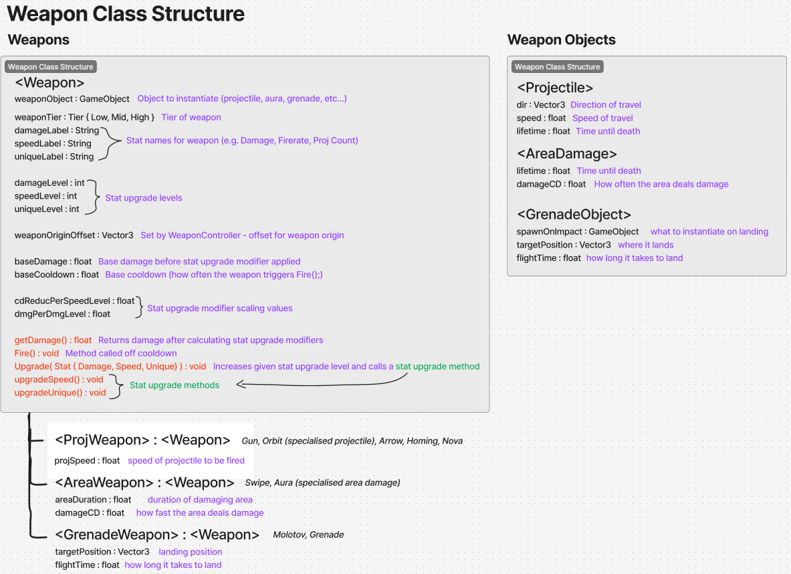

# Game Design Document (GDD)

  

_AI generated concept image of Lightbringer (Source: Bing Image Creator)_

### Table of contents

1. [Introduction](#introduction)
2. [Game Overview](#game-overview)
    - [Core Concept](#core-concept)
    - [Related Genres and Games](#related-genres-and-games)
    - [Target Audience](#target-audience)
    - [Unique Selling Points (USPs)](#unique-selling-points-usps)
3. [Story and Narrative](#story-and-narrative)
    - [Backstory](#backstory)
    - [Characters](#characters)
4. [Gameplay and Mechanics](#gameplay-and-mechanics)
    - [Player Perspective](#player-perspective)
    - [Controls](#controls)
    - [Progression](#progression)
    - [Gameplay Mechanics](#gameplay-mechanics)
5. [Levels and World Design](#levels-and-world-design)
    - [Game World](#game-world)
    - [Objects](#objects)
    - [Physics](#physics)
6. [Art and Audio](#art-and-audio)
    - [Art Style](#art-style)
    - [Sound and Music](#sound-and-music)
    - [Assets](#assets)
7. [User Interface (UI)](#user-interface-ui)
8. [Technology and Tools](#technology-and-tools)
9. [Team Communication, Timelines and Task Assignment](#team-communications-timelines-and-task-assignment)
10. [Possible Challenges](#possible-challenges)
11. [References](#references)

### Introduction

_Lightbringer_ is a third-person roguelike set in an unknown world of darkness. It's like Vampire Survivors with LIMBO aesthetics but more focused on exploration than combat. The player must fight off the darkness enclosing on them with tools of light, survive as long as they can while uncovering the mysteries of the past.

## Game Overview

### Core Concept

**_Venture into a world shrouded in darkness. Unveil the mysterious secrets of the past with your light, but tread carefully—haste may lead to your undoing._**

### Related Genres and Games

-   Roguelike
-   Auto-battler
-   RPG
-   Vampire Survivors
-   Hades

### Target Audience

Gameplay doesn't require any great deal of mechanical skill, targeting more casual players. Each playthrough of the game should be completable within 10 minutes. Controls and mechanics will be intuitive and easy to pick up without any help documentation or resources.

### Unique Selling Points (USPs)

-   Unique weapon/tool usage and combinations
-   Not the typical horde killer gameplay
-   Large-level instead of dungeon room based roguelike (The player can bee-line straight to the endgame zones from the start, whether they are ready or not)
-   More exploration focused
-   Has lore the user can discover or infer from environmental cues.
-   Unique resources
-   Non-linear progression
-   Subtle storytelling through narratives embedded in exploration (Environmental storytelling)

## Story and Narrative

### Backstory

An ancient forest, once teeming with life, has been enveloped by an unnatural darkness. No one knows how or why this occurred, but the light that once guided travellers is now just a faint wisp of its former glory. As time passes, the darkness has spread, warping the landscape and presumably its inhabitants. Legend speaks of an ancient, forgotten power buried deep within the forest, one that could hold the key to this curse—or its source.

You, a **being of light**, awaken at the heart of this darkened land. Stripped of memory, you find yourself drawn toward the scattered remnants of the world, guided by an inner pull and aided by small, glowing companions. These little lights act as your guides, nudging you toward **Points of Interest (POIs)** and giving you clues about your past and the calamity that has overtaken the land.

#### Premise

-   Area in the middle of a forest has been shrouded in darkness suddenly; unknown reason.
-   You’ve woken up, a being of light, in the middle of this mess, and it seems you have some little buddies helping you figure out where to go.

#### Storyline

-   You encounter and defeat different enemies and characters while trying to figure out what happened here
-   Each point of interest has something different to tell, a piece of the puzzle.

### Characters

_Player_

Player is a being of light, nothing is known much about them. They may have been connected to the forest's ancient light given their ability to absorb them into themselves…

_Ancient Light_

Manifested in a form akin to fireflies, these beings guide the player to points of interests providing the player with power as they find more of them.

_Enemies_

These strange abominations seem to have nothing in mind but to destroy you, the being of light. They seem to congregate around or maybe even originate from these peculiar points of interest…

## Gameplay and Mechanics

Player spawns at the outskirts of a darkness enshrouded forest. They have the ability to unveil their immediate surroundings and walk around. 
Not long after the player may find a trail of wisps/fireflies that they can absorb, granting them a resource and a direction to go.
The trails lead to strange points of interest, incomprehensible at times, but they also seem to harbour these more powerful wisps. Picking these up grants something more special to the player - a way to defend themselves.

When the player gathers enough of these wisps they have the ability to level up one of their stats by pressing “Tab”. Opening the pause menu “Esc” will also show the upgrades they have made to their stats.

### Player perspective

  

Third-Person perspective with a camera that can move around a point above the player character.

### Controls

-   WASD character control
-   Mouse to control third-person camera/aim
-   RMB to aim down sights (zoom in over shoulder)
-   Tab to open and close the level up screen
-   Esc to pause and resume the game (Contains menu options and player information)

### Progression

#### Player Progression

-   Gather wisps
-   Find POIs to acquire/upgrade weapons

#### Difficulty Progression

-   The deeper into the forest you go, the more difficult enemies appear

### Gameplay Mechanics

#### Combat Mechanic

-   Player uses light to reveal the darkness
-   Getting hit by an enemy decreases light radius
-   Player loses when light radius is gone
-   Light radius = HP

#### Weapon Mechanic

-   Player can have up to 3 weapons
-   Each has upgrades you can get for them with unique upgrades available for each weapon

#### Detailed Weapon Information

  

  

## Levels and World Design

### Game World

2.5D (look around with camera, plane of movement is pretty much top down 2D)
One (generated?) level for player to navigate, no map or minimap

  

### Gameplay Loop

  

### Objects

Buildings, dilapidated houses. Functions as environmental storytelling. Buckets?

### Physics

Certain points of interest may have interactable physics objects (rope hanging somewhere? Bucket on a rope?) (enemies drop interactable buckets?)
Certain weapons may interact with dynamic environmental objects.

## Art and Audio

### Art Style

#### Aesthetic

-   Mostly greyscale
-   Some colour highlights (eg. eyes different colour, enemy glowing outline different colour)

#### References

-   Limbo
-   Little Nightmares
-   Don’t Starve

  

Game Scene

### Sound and Music

Echoey - high reverb -> windy
White noise-ish -> eerie vibes

1. SFX for game selection (eg. hover over menu, switch item in inventory)
2. SFX for player character
    - walking on different surfaces
    - getting hit
    - picking up wisps
3. SFX for weapons
    - different weapons going off
4. SFX for enemies
    - enemies killed
    - enemies hit character
5. Ambient sounds
    - Freeing different areas adds to the ambient sounds
    - Fireflies
    - Tinkles and light sprinkle sounds
    - Echoes of past civilisation
6. Discover special enemies
    - Special sound for difficult enemies
7. Death-related instances
    - Suspenseful music before imminent death
    - Classical strings?
    - Death music
    - Strings wipe noise

### Assets

https://assetstore.unity.com/packages/3d/environments/fantasy/fantasy-forest-environment-free-demo-35361

https://assetstore.unity.com/packages/3d/environments/low-poly-medieval-market-262473#reviews

https://assetstore.unity.com/packages/3d/environments/campfires-torches-models-and-fx-242552

https://assetstore.unity.com/packages/3d/environments/dungeons/low-poly-dungeons-lite-177937#description

https://assetstore.unity.com/packages/3d/environments/fantasy/halloween-pack-cemetery-snap-235573

https://assetstore.unity.com/packages/3d/props/exterior/traditional-water-well-4477

https://assetstore.unity.com/packages/3d/props/exterior/tomb-65925

https://assetstore.unity.com/packages/3d/environments/historic/medieval-barrows-and-wagons-33411

https://assetstore.unity.com/packages/3d/props/exterior/ancient-ruins-and-plants-201914

## User Interface (UI)

-   Stamina bar up top
-   Exp bar down bottom
-   Pause menu (Also displays upgrades/weapons picked up)

  

## Technology and Tools

-   Unity 2022
-   GitHub
-   Figma for brainstorming/ideation
-   Trello
-   Audacity
-   Paint.net / Photoshop

## Team Communications, Timelines and Task Assignment

-   Discord meetings and Trello to delegate work
-   Figma/Google docs for collaborative document work

## Possible Challenges

-   Level design/asset finding
-   Weapon implementations
-   Enemy/darkness implementation
-   Character interactions
-   Procedural generation of terrain/trees/details

### References

Need more help? Check out these resources, which everything in this document is based on:

-   [GitHub Flavoured Markdown](https://guides.github.com/features/mastering-markdown/) (official guide)
-   [GitHub LaTeX](https://docs.github.com/en/get-started/writing-on-github/working-with-advanced-formatting/writing-mathematical-expressions)
-   [GitHub Diagrams](https://docs.github.com/en/get-started/writing-on-github/working-with-advanced-formatting/creating-diagrams)
-   [Mermaid Docs](https://mermaid-js.github.io/mermaid/#/)
-   [Mermaid Live Editor](https://mermaid-js.github.io/mermaid-live-editor/)
-   [Emoji Picker](https://github-emoji-picker.rickstaa.dev/)
